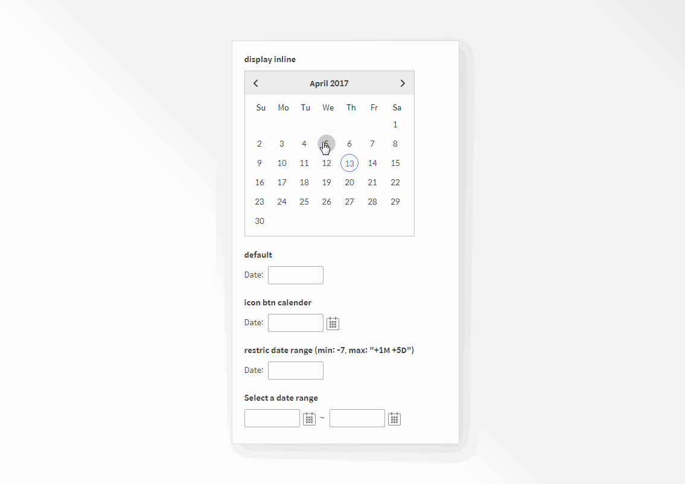

Customized the datepicker design of the jquery-ui widget.


Font : Spoqa han sans


[github repository link](https://github.com/songssss/datepicker){:target="_blank"}




---

```javascript
//display inline
$( function() {
	$( "#datepicker" ).datepicker();
} );

//default
$( function() {
	$( "#datepicker1" ).datepicker();
} );

//btn
$( function() {
	$( "#datepicker2" ).datepicker({
	  showOn: "button",
	  buttonImage: "images/calendar.png",
	  buttonImageOnly: true,
	  buttonText: "Select date"
	});
} );

//restric date range
$( function() {
	$( "#datepicker3" ).datepicker({ minDate: -7, maxDate: "+1M +5D" });
} );

//Select a date range 
$( function() {
var dateFormat = "mm/dd/yy",
  from = $( "#from" )
	.datepicker({
	  defaultDate: "+1w",
	  changeMonth: true,
	  numberOfMonths: 2,
	  showOn: "button",
	  buttonImage: "images/calendar.png",
	  buttonImageOnly: true,
	  buttonText: "Select date"
	})
	.on( "change", function() {
	  to.datepicker( "option", "minDate", getDate( this ) );
	}),
  to = $( "#to" ).datepicker({
	defaultDate: "+1w",
	changeMonth: true,
	numberOfMonths: 2,
	showOn: "button",
	buttonImage: "images/calendar.png",
	buttonImageOnly: true,
	buttonText: "Select date"
  })
  .on( "change", function() {
	from.datepicker( "option", "maxDate", getDate( this ) );
  });

function getDate( element ) {
  var date;
  try {
	date = $.datepicker.parseDate( dateFormat, element.value );
  } catch( error ) {
	date = null;
  }

  return date;
}
} );
```

```html
<section>
	<div class="date_group">
		<p class="tit">display inline</p>
		<div id="datepicker"></div>
	</div>
</section>

<section>
	<div class="date_group">
		<p class="tit">default</p>
		<label for="datepicker1">Date: </label>
		<input type="text" id="datepicker1">
	</div>
</section>

<section>
	<div class="date_group">
		<p class="tit">icon btn calender</p>
		<label for="datepicker2">Date: </label>
		<input type="text" id="datepicker2">
	</div>
</section>

<section>
	<div class="date_group">
		<p class="tit">restric date range (min: -7, max: "+1M +5D")</p>
		<label for="datepicker3">Date: </label>
		<input type="text" id="datepicker3">
	</div>
</section>

<section>
	<div class="date_group">
		<p class="tit">Select a date range</p>
		<input type="text" id="from" name="from">
		<span class="range">~</span>
		<input type="text" id="to" name="to">
	</div>
</section>
```
