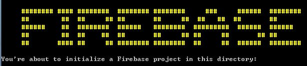

{:.sub_txt}
Firebase realtime Dtabase / Authentication / Hosting

---

### FIREBASE Install / 파이어베이스설치 

npm install firebase-tools -g

permission denied (admin)
-> sudo npm install firebase-tools -g

---

### CLI success

firebase login

y


*** project list

firebase list


*** firebase init

mkdir folder

cd folder

firebase init




---

database select

project select

ruleset

기본이름으로

database.rule.json

---

### hosting step

public directory Y

index.html redirect Y


---

firebase serve

localhost:5000

---

script

```javascript
var auth, database, userInfo, selectedKey;
  // Initialize Firebase

auth = firebase.auth();
database = firebase.database();
var authProvider = new firebase.auth.GoogleAuthProvider();


// 로그인 결과에 따른 콜백 함수
auth.onAuthStateChanged(function(user){
  if(user){ // 인증 성공
    console.log("Success");
    console.log(user);
    userInfo = user;
    get_memo_list();
  }else{    // 인증 실패
    auth.signInWithPopup(authProvider);
  }
});

function get_memo_list(){
  var memoRef = database.ref('/memos/'+userInfo.uid);
  memoRef.on('child_added', on_child_added);
  memoRef.on('child_changed', function(data){
    console.log(data.key);
    var key = data.key;
    var txt = data.val().txt;
    var title = txt.substr(0, txt.indexOf('\n'));
    $("#"+key+">.title").text(title);
    $("#"+key+">.txt").text(txt);
  });
}
function on_child_added(data){
  console.log(data.val());
  var key = data.key;
  var memoData = data.val();
  var txt = memoData.txt;
  var title = txt.substr(0, txt.indexOf('\n'));
  var firstTxt = txt.substr(0, 1);
  
  var html = "<li id='"+key+"' class='collection-item avatar' onclick='fn_get_data_one(this.id);'>" +
      "<i class='material-icons circle red'>"+firstTxt+"</i>" +
      "<span class='title'>"+title+"</span>" +
      "<p class='txt'>" + txt + "<br />" +
      "</p>"+
      "<a href='#!' onclick=\"fn_delete_data(\'"+key+"\')\" class='secondary-content'><i class='material-icons'>grade</i></a>"
    "</li>"
    $(".collection").append(html);
}

function fn_get_data_one(key){
  selectedKey = key;
  var memoRef = database.ref('memos/'+userInfo.uid+'/'+key)
  .once('value')
  .then(function(snapshot){
    if(snapshot.val() != null){
      $(".textarea").val(snapshot.val().txt);
    }
  });
}

function save_data(){
  var memoRef = database.ref('/memos/'+userInfo.uid);
  var txt = $(".textarea").val();
  if( txt == '' ){
    return;
  }

  if(selectedKey){
    memoRef = database.ref('/memos/'+userInfo.uid+'/'+selectedKey);
    memoRef.update({
      txt: txt,
      updateDate : new Date().getTime()
    });
  }else{
    memoRef.push({
      txt: txt,
      createDate : new Date().getTime()
    });
  }
}

function initMemo(){
  $(".textarea").val('');
  selectedKey = null;
}
function fn_delete_data(key){
  if(confirm("삭제하시겠습니까?")){
    var memoRef = database.ref('/memos/'+userInfo.uid+'/'+key);
    memoRef.remove(); //firebase data remove
    $("#"+key).remove(); //element remove
  }
  initMemo();
}
$(function(){
  $(".textarea").blur(function(){
    save_data();
  });
});
```

---

### hosting

firebase deploy


---

[memowebapp](https://memowebapp-1e86d.firebaseapp.com/){:target="_blank"}
