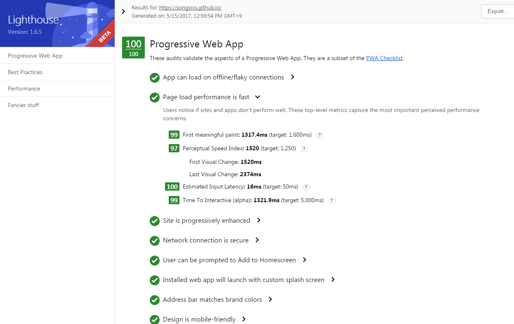

Improving with  Gitgub Blog Progressive Web Apps

깃허브 블로그 프로그레시브웹앱으로 개선하기


[Progressive Web App Checklist](https://developers.google.com/web/progressive-web-apps/checklist){:target="_blank"}

---

### Use a Service Worker / 서비스워커 추가

The start URL (at least) loads while offline

서비스 워커는 브라우저가 백그라운드에서 실행하는 스크립트로 오프라인 경험, 주기적 백그라운드 동기화, 푸시알림을 지원한다.

갑자기 오프라인 환경으로 전환되더라도 공룡을 보여주지 말자


[Service Worker](https://developers.google.com/web/fundamentals/getting-started/primers/service-workers){:target="_blank"}

```javascript

if ('serviceWorker' in navigator) {
  window.addEventListener('load', function() {
    navigator.serviceWorker.register('/sw.js').then(function(registration) {
      // Registration was successful
      console.log('ServiceWorker registration successful with scope: ', registration.scope);
    }).catch(function(err) {
      // registration failed :(
      console.log('ServiceWorker registration failed: ', err);
    });
  });
}


//서비스 워커 설치
self.addEventListener('install', function(event) {
  // Perform install steps
});


var CACHE_NAME = 'my-site-cache-v1';
var urlsToCache = [
  '/',
  '/styles/main.css',
  '/script/main.js'
];

self.addEventListener('install', function(event) {
  // Perform install steps
  event.waitUntil(
    caches.open(CACHE_NAME)
      .then(function(cache) {
        console.log('Opened cache');
        return cache.addAll(urlsToCache);
      })
  );
});


//요청 캐시 및 반환
self.addEventListener('fetch', function(event) {
  event.respondWith(
    caches.match(event.request)
      .then(function(response) {
        // Cache hit - return response
        if (response) {
          return response;
        }
        return fetch(event.request);
      }
    )
  );
});


//업데이트
self.addEventListener('activate', function(event) {

  var cacheWhitelist = ['pages-cache-v1', 'blog-posts-cache-v1'];

  event.waitUntil(
    caches.keys().then(function(cacheNames) {
      return Promise.all(
        cacheNames.map(function(cacheName) {
          if (cacheWhitelist.indexOf(cacheName) === -1) {
            return caches.delete(cacheName);
          }
        })
      );
    })
  );
});

```

---

### Add a Web App Manifest / 매니페스트 추가

Metadata provided for Add to Home screen

홈스크린에 추가시 보여질 아이콘, 이름 설정

---

### add meta tag & script

```html
<!-- Define the Right Viewport -->
<meta name="viewport" content="width=device-width; initial-scale=1.0; maximum-scale=1.0; user-scalable=no" />

<!-- add manifest -->
<link rel="manifest" href="manifest.json">

<!-- Set Up the App Icon -->
<link rel="apple-touch-icon" href="URL">
<link rel="apple-touch-icon-precomposed" href="URL">
<link rel="icon" href="URL/favicon.ico">

<!-- Load It Like A Native App -->
<meta name="apple-touch-fullscreen" content="yes">
<meta name="apple-mobile-web-app-capable" content="yes">
<meta name="apple-mobile-web-app-status-bar-style" content="black">

<meta name="msapplication-TileImage" content="URL">
<meta name="msapplication-TileColor" content="#4169e1">
<meta name="theme-color" content="#4169e1">

<!-- Customize the Startup Screen not work... -->
<link rel="apple-touch-startup-image" href="URL">

<!-- Navigate Within the Web App  -->
<script>(function(a,b,c){if(c in b&&b[c]){var d,e=a.location,f=/^(a|html)$/i;a.addEventListener("click",function(a){d=a.target;while(!f.test(d.nodeName))d=d.parentNode;"href"in d&&(d.href.indexOf("http")||~d.href.indexOf(e.host))&&(a.preventDefault(),e.href=d.href)},!1)}})(document,window.navigator,"standalone")</script> 
```

---

### Lighthouse tool

웹 앱 품질 개선 오픈소스 자동화도구 라이트하우스

Lighthouse는 현재 홈스크린에 추가, 오프라인 지원, 프로그레시브 웹 앱 기능에 중점으로 가장 중요한 목표는 웹 앱 품질의 모든 측면에 대한 end-to-end 테스트를 제공한다.


[Progressive Web App Checklist](https://developers.google.com/web/tools/lighthouse/){:target="_blank"}




I got 100 points! :smile:

100점 받았다. 신난다 :relaxed:


